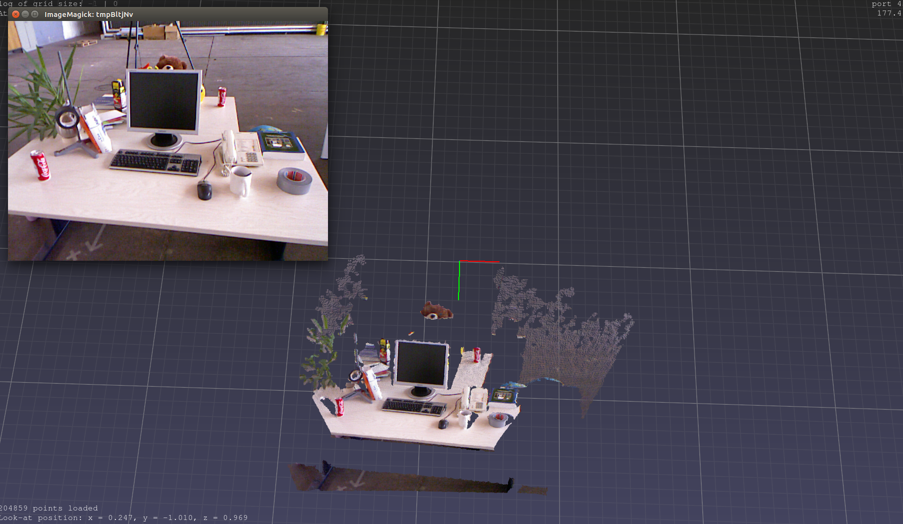

## VizKinectDepthCLoudOneImage
### A small tool used for visualizing pointcloud generating from one depth image which is get from Kinect   
it mainly uses **pptk** to work, so make sure to install **pptk**
``` shell
pip install pptk
```
you need to modify some parameters in here(default is tum dataset camera intrinsics)
``` python
# camera intrinsics.  modify them
fx = 520.9
cx = 325.1
fy = 521.0
cy = 249.7
scale = 5000.0
```
### Simple Result Of this Code

